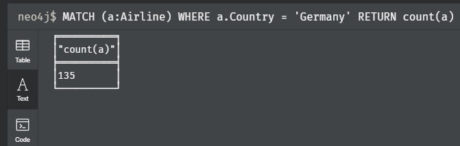

# Task 2 - Lab Training Database Systems SS20

## Shahriar Yazdipour [matr. No:62366]

The data that is used here can be loaded from <https://openflights.org/data.html>.

a) Load the three data files into Neo4J. You can manually download and copy them into the
Docker container, or use their direct website links in Neo4J to load them. Do not forget to
rename the attributes according to their description on the website, else it might be hard to
query them later. In addition, create relationships between them where necessary – e.g. a relationship for the Airline ID attribute of Routes, referencing to the ID attribute of Airlines (obviously).

```sh
docker pull neo4j
docker run \
    --publish=7474:7474 --publish=7687:7687 \
    --volume=$HOME/neo4j/data:/data \
    --env=NEO4J_AUTH=none \
    neo4j
```

Airport.dat

```sql
LOAD CSV FROM "https://raw.githubusercontent.com/jpatokal/openflights/master/data/airports.dat" AS line
CREATE (:Airport{
    AirportID:line[0],
    Name:line[1],
    City:line[2],
    Country:line[3],
    IATA:line[4],
    ICAO:line[5],
    Latitude:line[6],
    Longitude:line[7],
    Altitide:line[8],
    Timezone:line[9],
    DST:line[10],
    TzDB :line[11],
    Type:line[12],
    Source:line[13]});
CREATE INDEX ON :Airport(AirportID)
```

Airline.dat

```sql
LOAD CSV FROM "https://raw.githubusercontent.com/jpatokal/openflights/master/data/airlines.dat" AS line
CREATE (:Airline{
    AirlineID:line[0],
    Name:line[1],
    Alias:line[2],
    IATA:line[3],
    ICAO:line[4],
    Callsign:line[5],
    Country:line[6],
    Active:line[7]});
CREATE INDEX ON :Airline(AirlineID)
```

Route.dat

```sql
LOAD CSV FROM "https://raw.githubusercontent.com/jpatokal/openflights/master/data/routes.dat" AS line
CREATE (:Route{
    Airline:line[0],
    AirlineID:line[1],
    SourceAirport:line[2],
    SourceAirportID:line[3],
    DestinationAirport:line[4],
    DestinationAirportID:line[5],
    Codeshare:line[6],
    Stops:line[7],
    Equipment:line[8]});
CREATE INDEX ON :Route(AirlineID);
CREATE INDEX ON :Route(AirportID)
```

AirlineID --[flight]-> Route Relation:

```sql
MATCH (a:Airline) MATCH (route:Route{AirlineID:a.AirlineID}) MERGE (route)-[:flight]->(a);
```

Airport --[src/dest]-> Route Relation:

```sql
MATCH (a:Airport) MATCH (route:Route{SourceAirportID:a.AirportID}) MERGE (route)-[:src]->(a);
MATCH (a:Airport) MATCH (route:Route{DestinationAirportID:a.AirportID}) MERGE (route)-[:dest]->(a);
```

b) Answer the eight given queries in Cypher for your task.

=> For the PDF: Add your solution to the queries as well as the result from execution. If the
result is too big (e.g. a thousand nodes), limit the output to 10 by adding LIMIT 10 to your
solution.

### Queries

a) How many airlines belong to Germany?

```sql
MATCH (a:Airline) WHERE a.Country = 'Germany' RETURN count(a)
-- OR
MATCH (a:Airline{Country:'Germany'}) RETURN count(a)
```



b) How many flights are leaving from Frankfurt am Main Airport?

```sql
MATCH (:Route)-[:src]-(:Airport{Name:'Frankfurt am Main Airport'}) RETURN COUNT(*)

╒══════════╕
│"COUNT(*)"│
╞══════════╡
│497       │
└──────────┘
```

Which of them are heading to an airport in Canada?

```sql
MATCH (r:Route)-[:src]-(:Airport{Name:'Frankfurt am Main Airport'}) MATCH (r)-[:dest]-(a:Airport{Country:'Canada'}) RETURN DISTINCT a.Name

╒═════════════════════════════════════════════════════════╕
│"a.Name"                                                 │
╞═════════════════════════════════════════════════════════╡
│"Halifax / Stanfield International Airport"              │
├─────────────────────────────────────────────────────────┤
│"Ottawa Macdonald-Cartier International Airport"         │
├─────────────────────────────────────────────────────────┤
│"Montreal / Pierre Elliott Trudeau International Airport"│
├─────────────────────────────────────────────────────────┤
│"Vancouver International Airport"                        │
├─────────────────────────────────────────────────────────┤
│"Calgary International Airport"                          │
├─────────────────────────────────────────────────────────┤
│"Lester B. Pearson International Airport"                │
└─────────────────────────────────────────────────────────┘
```

c) Which airlines are flying **from or to** Frankfurt am Main Airport? We are looking for the
names of the airlines.

```sql
MATCH (r:Route) WHERE (r)-[:dest]-(:Airport{City:"Frankfurt"}) OR (r)-[:src]-(:Airport{City:"Frankfurt"}) MATCH (r)-[flight]-(a:Airline) RETURN DISTINCT a.Name LIMIT 10

╒═══════════════════╕
│"a.Name"           │
╞═══════════════════╡
│"Germanwings"      │
├───────────────────┤
│"Air Moldova"      │
├───────────────────┤
│"Aegean Airlines"  │
├───────────────────┤
│"American Airlines"│
├───────────────────┤
│"Air Berlin"       │
├───────────────────┤
│"Air Canada"       │
├───────────────────┤
│"Air France"       │
├───────────────────┤
│"Air Algerie"      │
├───────────────────┤
│"Air India Limited"│
├───────────────────┤
│"Royal Air Maroc"  │
└───────────────────┘
```

d) How many airlines exist in the dataset?

```sql
MATCH (:Airline) RETURN COUNT(*)

╒══════════╕
│"COUNT(*)"│
╞══════════╡
│6162      │
└──────────┘
```

What is the percentage of airlines having no value for callsigns, compared to all of them?

```sql
MATCH (:Airline{Callsign:''}) WITH COUNT(*) AS c MATCH (a:Airline) RETURN 100.0*c/Count(a)

╒══════════════════╕
│"100.0*c/Count(a)"│
╞══════════════════╡
│13.112625770853619│
└──────────────────┘
```

e) How many airports are more than 150 times destination of a flight?

```sql
MATCH (:Route)-[:dest]->(a:Airport) WITH COUNT(*) AS c, a WHERE c>150 RETURN COUNT(a)

╒═══════════════╕
│"COUNT(a)"     │
╞═══════════════╡
│104            │
└───────────────┘
```

How many airports are acting as source of flight more than 150 times?

```sql
MATCH (:Route)-[:src]->(a:Airport) WITH COUNT(*) AS c, a WHERE c>150 RETURN COUNT(a)

╒═══════════════╕
│"COUNT(a)"     │
╞═══════════════╡
│105            │
└───────────────┘
```

Are both numbers equal? **-NO-**

f) Which airlines are flying over 1000 routes? => names & number of routes they are flying.

```sql
MATCH (a:Airline)<-[:flight]-(:Route) WITH COUNT(*) AS count,a WHERE count>1000 RETURN a.Name, count

╒═════════════════════════╤═══════╕
│"a.Name"                 │"count"│
╞═════════════════════════╪═══════╡
│"American Airlines"      │2354   │
├─────────────────────────┼───────┤
│"Air France"             │1071   │
├─────────────────────────┼───────┤
│"Air China"              │1260   │
├─────────────────────────┼───────┤
│"China Eastern Airlines" │1263   │
├─────────────────────────┼───────┤
│"China Southern Airlines"│1454   │
├─────────────────────────┼───────┤
│"Delta Air Lines"        │1981   │
├─────────────────────────┼───────┤
│"easyJet"                │1130   │
├─────────────────────────┼───────┤
│"Ryanair"                │2484   │
├─────────────────────────┼───────┤
│"Southwest Airlines"     │1146   │
├─────────────────────────┼───────┤
│"United Airlines"        │2180   │
├─────────────────────────┼───────┤
│"US Airways"             │1960   │
└─────────────────────────┴───────┘
```

g) How many airports can be reached with a maximum of two flights starting from Frankfurt am Main Airport? Be aware of duplicates with respect to airport names; make sure that each airport is only counted as one!

```sql
MATCH (:Airport{Name:'Frankfurt am Main Airport'})-[:src]-(:Route)-[:dest]-(:Airport)-[:src]-(:Route)-[:dest]-(a:Airport) RETURN COUNT(DISTINCT a)

╒═══════════════════╕
│"COUNT(DISTINCT a)"│
╞═══════════════════╡
│1959               │
└───────────────────┘
```

h) If the source of a flight is Erfurt Airport, how many intermediate airports are necessary until there is a flight back to Erfurt Airport (e.g., Erfurt Airport→…→Erfurt Airport)?
What are the names of those airports allowing to travel to and from Erfurt? You can solve it with recursion.

```sql
MATCH (:Airport{Name:'Erfurt Airport'})-[:src *0..]-(:Route)-[:dest *0..]-(:Airport{Name:'Erfurt Airport'}) RETURN COUNT(*)

╒═══════════════╕
│"COUNT(*)"     │
╞═══════════════╡
│0              │
└───────────────┘
```

### Two more queries that a user could pose to this graph database

i) What are the top 10 most crowded airports - sorted?

```sql
MATCH (a:Airport)<-[:src]-(r:Route) WITH COUNT(*) AS c , a RETURN a.Name,c ORDER BY c DESC LIMIT 10

╒══════════════════════════════════════════════════╤═══╕
│"a.Name"                                          │"c"│
╞══════════════════════════════════════════════════╪═══╡
│"Hartsfield Jackson Atlanta International Airport"│915│
├──────────────────────────────────────────────────┼───┤
│"Chicago O'Hare International Airport"            │558│
├──────────────────────────────────────────────────┼───┤
│"Beijing Capital International Airport"           │535│
├──────────────────────────────────────────────────┼───┤
│"London Heathrow Airport"                         │527│
├──────────────────────────────────────────────────┼───┤
│"Charles de Gaulle International Airport"         │524│
├──────────────────────────────────────────────────┼───┤
│"Frankfurt am Main Airport"                       │497│
├──────────────────────────────────────────────────┼───┤
│"Los Angeles International Airport"               │492│
├──────────────────────────────────────────────────┼───┤
│"Dallas Fort Worth International Airport"         │469│
├──────────────────────────────────────────────────┼───┤
│"John F Kennedy International Airport"            │456│
├──────────────────────────────────────────────────┼───┤
│"Amsterdam Airport Schiphol"                      │453│
└──────────────────────────────────────────────────┴───┘
```

j) What is the percentage of the routes without stops.

```sql
MATCH (r:Route) with Count(r) as c MATCH (r) WHERE r.stops="0" RETURN 100.0*COUNT(r)/c

╒═══════════════════╕
│"100.0*COUNT(rr)/c"│
╞═══════════════════╡
│99.98374296144127  │
└───────────────────┘
```
